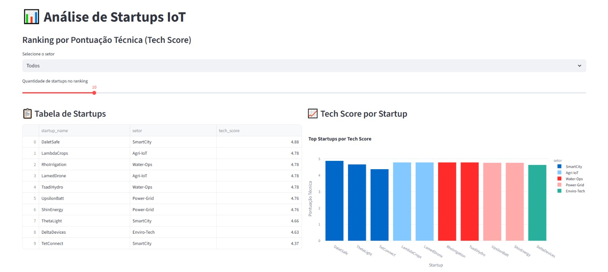
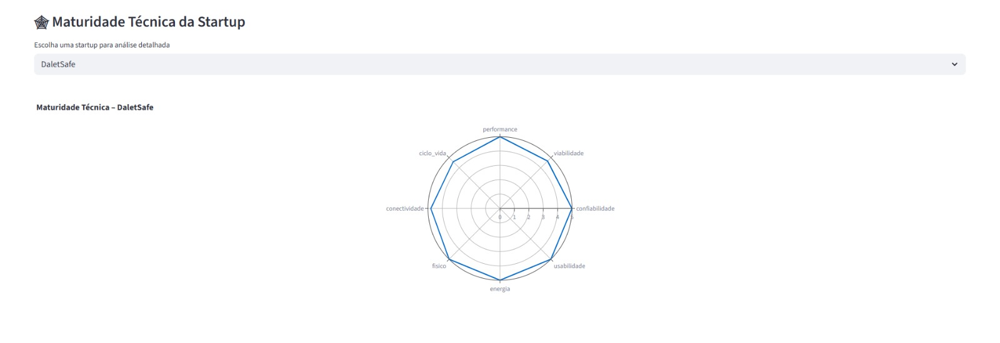
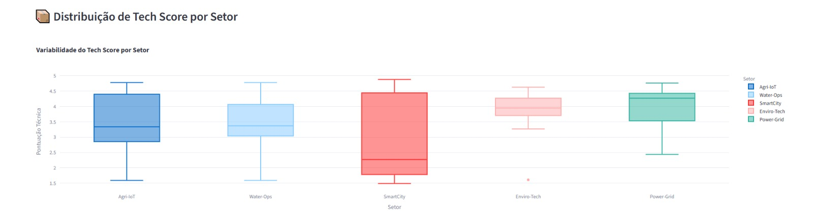

<h1 align="center">📊 IoT Startup Analytics</h1>

  <strong>Análise de maturidade técnica de startups IoT com Python, SQL e Streamlit</strong>

<h2>🧠 Visão Geral</h2>

O <strong>IoT Startup Analytics</strong> é um projeto de análise de dados voltado para avaliação da
maturidade técnica de startups de Internet das Coisas (IoT).

O objetivo é transformar dados brutos de avaliações técnicas em <strong>insights estratégicos</strong>
por meio de um pipeline de dados estruturado e um <strong>dashboard interativo</strong>.

<h2>🚩 Problema</h2>

<ul>
  <li>Dados espalhados em planilhas</li>
  <li>Sem visão consolidada</li>
  <li>Dificuldade de comparação entre startups</li>
  <li>Decisões de investimento pouco embasadas</li>
</ul>

<h2>✅ Solução</h2>

Foi desenvolvido um pipeline completo que:

<ol>
  <li>Lê dados brutos em CSV</li>
  <li>Normaliza e transforma as métricas</li>
  <li>Calcula indicadores técnicos</li>
  <li>Armazena os dados em SQLite</li>
  <li>Executa consultas SQL reutilizáveis</li>
  <li>Exibe tudo em um dashboard interativo</li>
</ol>

<h2>🛠 Tecnologias</h2>

<table>
  <tr><td>Python</td><td>Pandas</td><td>SQLite</td></tr>
  <tr><td>SQL</td><td>Streamlit</td><td>Plotly</td></tr>
</table>

<h2>🏗 Arquitetura</h2>

<pre>
iot-startup-analytics/
├─ data/
│  ├─ startups.csv
│  └─ app.db
│
└─ app/
   ├─ main.py
   ├─ db.py
   ├─ seed.py
   └─ queries.py
</pre>

<h2>📊 Funcionalidades</h2>

<ul>
  <li>Ranking de startups</li>
  <li>Filtro por setor</li>
  <li>Gráfico de barras</li>
  <li>Boxplot por setor</li>
  <li>Radar de maturidade técnica</li>
</ul>

<h2>📐 Dimensões Avaliadas</h2>

<table>
  <tr><th>Dimensão</th><th>Grupo</th></tr>
  <tr><td>Performance</td><td>1.x</td></tr>
  <tr><td>Viabilidade</td><td>2.x</td></tr>
  <tr><td>Confiabilidade</td><td>3.x</td></tr>
  <tr><td>Usabilidade</td><td>4.x</td></tr>
  <tr><td>Energia</td><td>5.x</td></tr>
  <tr><td>Físico</td><td>6.x</td></tr>
  <tr><td>Conectividade</td><td>7.x</td></tr>
  <tr><td>Ciclo de Vida</td><td>8.x</td></tr>
</table>

<h2>▶️ Como Executar</h2>

<pre>
git clone https://github.com/SEU-USUARIO/iot-startup-analytics.git
cd iot-startup-analytics

python -m venv .venv
.venv\Scripts\activate

pip install -r requirements.txt
python app/seed.py
streamlit run app/main.py
</pre>

O navegador abrirá automaticamente em:
 
<strong>http://localhost:8501</strong>

<h2>📸 Visual do Projeto</h2>

Adicione aqui screenshots do dashboard:

<pre>
<h2>📸 Visual do Projeto</h2>

<h3>Dashboard Principal</h3>

<h3>Gráfico Radar</h3>

<h3>Boxplot por Setor</h3>

</pre>

<h2>👤 Autor</h2>

<strong>Eric Amaral</strong> 
Projeto desenvolvido para portfólio em Data Analytics / Ciência de Dados.

